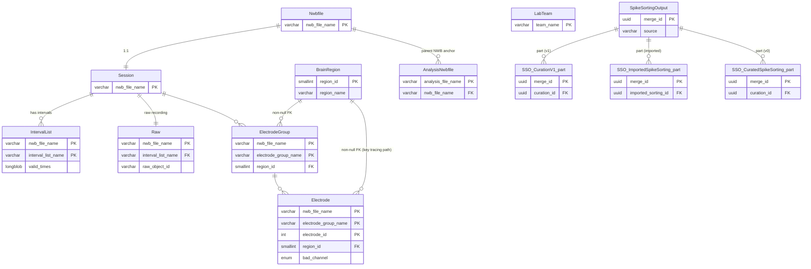

# Baseline — Spyglass tables v2 plugs into

[← README](README.md) · [next: Phase 1 →](01-phase-1.md)

This is the **starting state**. v2 introduces no schemas here; this diagram exists so the FK arrows in later diagrams have a target. None of these tables are modified by v2 except where noted.

## What v2 touches

| Table | v2 interaction |
| --- | --- |
| `Session`, `Raw`, `IntervalList` | Referenced (FK target) by `RecordingSelection`, `SessionGroup.Member`, `SharedArtifactGroup`. |
| `Electrode`, `ElectrodeGroup`, `BrainRegion` | FK target of `SortGroupV2.SortGroupElectrode`, `Sorting.Unit`, `CurationV2.Unit`. Brain region tracing relies on `Electrode → BrainRegion` (non-null FK). |
| `AnalysisNwbfile` | Every Computed table that materializes data writes an `AnalysisNwbfile` row. v2 reuses Spyglass's existing cleanup / export / kachery / recompute machinery; no parallel cache. |
| `LabTeam` | FK on `RecordingSelection`, `SessionGroup.Member`. Per-team ownership preserved from v1. |
| `UserEnvironment` | FK on `RecordingArtifactRecomputeSelection`, `SortingAnalyzerRecomputeSelection` (Phase 2). |
| `SpikeSortingOutput` | Merge master. v2 adds ONE new part: `SpikeSortingOutput.CurationV2`. The other three parts (`CurationV1`, `ImportedSpikeSorting`, `CuratedSpikeSorting`) are untouched. |

## Diagram

## Notes

- **`BrainRegion` PK is `region_id` (smallint auto-increment), not `region_name`.** v2 represents "unknown region" by inserting a single `BrainRegion` row with `region_name="Unknown"` and using the auto-generated `region_id` as the FK target. See [common_region.py:9](../../../../src/spyglass/common/common_region.py#L9).
- **`Electrode → BrainRegion` is NON-NULL** ([common_ephys.py:79](../../../../src/spyglass/common/common_ephys.py#L79)). v2's unit→region tracing chain (`Sorting.Unit * Electrode * BrainRegion`) relies on this guarantee.
- **`SpikeSortingOutput` merge master is unchanged** in v2; only a new `CurationV2` part is added in Phase 1.
- **`AnalysisNwbfile` has a single `Nwbfile` parent** ([common_nwbfile.py:630](../../../../src/spyglass/common/common_nwbfile.py#L630)). For v2's cross-session artifacts (concat `Sorting`, `UnitMatch`), the parent is the first `SessionGroup.Member` by `member_index` — see Phase 3 / Phase 4 anchor rule.
- The merge-part names shown here (`SSO_CurationV1_part`, etc.) are Mermaid identifiers; the real class names are `SpikeSortingOutput.CurationV1`, `SpikeSortingOutput.ImportedSpikeSorting`, `SpikeSortingOutput.CuratedSpikeSorting`.
