# Phase 1 — Single-session sort MVP

[← Baseline](00-baseline.md) · [README](README.md) · [next: Phase 2 →](02-phase-2.md)

End-to-end single-session sort: preprocessing → artifact detection → sorting → initial curation → registration in `SpikeSortingOutput`. All schemas are **final** under the zero-migration policy; Phases 2–5 only add tables, they never alter ones declared here.

## What ships in Phase 1

| New table | Tier | Purpose |
| --- | --- | --- |
| `SortGroupV2` (+ `SortGroupElectrode` part) | Manual | Per-session electrode grouping; ports v1 `SortGroup` with safe overwrite. |
| `PreprocessingParameters` | Lookup | Bandpass + CMR + optional whiten; Pydantic-validated. |
| `RecordingSelection` | Manual | One row per (raw, sort group, sort interval, preproc params, team). UUID PK. |
| `Recording` | Computed | NWB-resident preprocessed `ElectricalSeries` inside an `AnalysisNwbfile`. |
| `ArtifactDetectionParameters` | Lookup | Threshold detection parameters. |
| `SharedArtifactGroup` (+ `Member` part) | Manual | Opt-in: cross-recording artifact detection (issue #928). |
| `ArtifactDetectionSelection` | Manual | Source parts: either `RecordingSource` or `SharedArtifactGroupSource`. |
| `ArtifactDetection` | Computed | Writes artifact-removed valid times to `common.IntervalList` as `f"artifact_{artifact_id}"`. |
| `SorterParameters` | Lookup | Per-sorter Pydantic-validated params; MS4 / MS5 / KS4 / clusterless / SC2 / TDC2. |
| `SortingSelection` | Manual | Source parts for `Recording` / `ConcatenatedRecording`, plus nullable `ArtifactDetection`. |
| `Sorting` (+ `Unit` part) | Computed | Sorts via SI 0.104; writes units NWB + SortingAnalyzer folder; persists per-unit peak channel. |
| `CurationV2` (+ `Unit` + `UnitLabel` parts) | Manual | Curation lineage; auto-registers in `SpikeSortingOutput.CurationV2`. |
| `SpikeSortingOutput.CurationV2` | Part of merge master | v2's hookup to the existing merge. |

| Phase 1 forward-compat (declared, not populated) | Tier | Why now |
| --- | --- | --- |
| `SessionGroup` (+ `Member` part) | Manual | `ConcatenatedRecordingSelection` FK target. |
| `MotionCorrectionParameters` | Lookup | `ConcatenatedRecordingSelection` FK target. |
| `ConcatenatedRecordingSelection` | Manual | `SortingSelection.ConcatenatedRecordingSource` FK target. |
| `ConcatenatedRecording` | Computed (`make()` raises `NotImplementedError`) | Final schema today; Phase 3 fills the body. |

## ER diagram

```mermaid
erDiagram
    %% ===== Baseline (existing) =====

    %% =========================================================
    %% Sort grouping
    %% =========================================================
    SortGroupV2 {
        varchar nwb_file_name PK
        int sort_group_id PK
        int sort_reference_electrode_id
    }
    SortGroupV2_SortGroupElectrode {
        varchar nwb_file_name PK
        int sort_group_id PK
        varchar electrode_group_name PK
        int electrode_id PK
    }
    Session ||--o{ SortGroupV2 : ""
    SortGroupV2 ||--o{ SortGroupV2_SortGroupElectrode : "part"
    Electrode ||--o{ SortGroupV2_SortGroupElectrode : "FK"

    %% =========================================================
    %% Recording preprocessing
    %% =========================================================
    PreprocessingParameters {
        varchar preproc_params_name PK
        blob params
        int params_schema_version
    }
    RecordingSelection {
        uuid recording_id PK
        varchar nwb_file_name FK
        int sort_group_id FK
        varchar interval_list_name FK
        varchar preproc_params_name FK
        varchar team_name FK
    }
    Recording {
        uuid recording_id PK
        varchar analysis_file_name FK
        varchar electrical_series_path
        varchar object_id
        char cache_hash
    }

    Raw ||--o{ RecordingSelection : "FK"
    SortGroupV2 ||--o{ RecordingSelection : "FK"
    IntervalList ||--o{ RecordingSelection : "sort interval"
    PreprocessingParameters ||--o{ RecordingSelection : "FK"
    LabTeam ||--o{ RecordingSelection : "FK"
    RecordingSelection ||--|| Recording : "Computed"
    AnalysisNwbfile ||--o{ Recording : "NWB artifact"

    %% =========================================================
    %% Artifact detection
    %% =========================================================
    ArtifactDetectionParameters {
        varchar artifact_params_name PK
        blob params
    }
    SharedArtifactGroup {
        varchar shared_artifact_group_name PK
        varchar nwb_file_name FK
    }
    SharedArtifactGroup_Member {
        varchar shared_artifact_group_name PK
        uuid recording_id PK
    }
    ArtifactDetectionSelection {
        uuid artifact_id PK
        varchar artifact_params_name FK
    }
    ArtifactDetectionSelection_RecordingSource {
        uuid artifact_id PK
        uuid recording_id FK
    }
    ArtifactDetectionSelection_SharedArtifactGroupSource {
        uuid artifact_id PK
        varchar shared_artifact_group_name FK
    }
    ArtifactDetection {
        uuid artifact_id PK
    }

    Session ||--o{ SharedArtifactGroup : "FK"
    SharedArtifactGroup ||--o{ SharedArtifactGroup_Member : "part"
    Recording ||--o{ SharedArtifactGroup_Member : "FK"
    ArtifactDetectionSelection ||--o{ ArtifactDetectionSelection_RecordingSource : "part"
    ArtifactDetectionSelection ||--o{ ArtifactDetectionSelection_SharedArtifactGroupSource : "part"
    Recording ||--o{ ArtifactDetectionSelection_RecordingSource : "FK"
    SharedArtifactGroup ||--o{ ArtifactDetectionSelection_SharedArtifactGroupSource : "FK"
    ArtifactDetectionParameters ||--o{ ArtifactDetectionSelection : "FK"
    ArtifactDetectionSelection ||--|| ArtifactDetection : "Computed"
    ArtifactDetection ||..o{ IntervalList : "writes artifact_{artifact_id} row(s)"

    %% =========================================================
    %% Sorting
    %% =========================================================
    SorterParameters {
        varchar sorter PK
        varchar sorter_params_name PK
        blob params
    }
    SortingSelection {
        uuid sorting_id PK
        varchar sorter FK
        varchar sorter_params_name FK
        uuid artifact_id "nullable FK"
    }
    SortingSelection_RecordingSource {
        uuid sorting_id PK
        uuid recording_id FK
    }
    SortingSelection_ConcatenatedRecordingSource {
        uuid sorting_id PK
        uuid concat_recording_id FK
    }
    Sorting {
        uuid sorting_id PK
        varchar analysis_file_name FK
        varchar object_id
        varchar analyzer_folder
        int n_units
    }
    Sorting_Unit {
        uuid sorting_id PK
        int unit_id PK
        varchar nwb_file_name FK
        varchar electrode_group_name FK
        int electrode_id FK
        float peak_amplitude_uV
        int n_spikes
    }

    SortingSelection ||--o{ SortingSelection_RecordingSource : "part"
    SortingSelection ||--o{ SortingSelection_ConcatenatedRecordingSource : "part"
    Recording ||--o{ SortingSelection_RecordingSource : "FK"
    SorterParameters ||--o{ SortingSelection : "FK"
    ArtifactDetection ||--o{ SortingSelection : "FK (nullable)"
    SortingSelection ||--|| Sorting : "Computed"
    AnalysisNwbfile ||--o{ Sorting : "units NWB"
    Sorting ||--o{ Sorting_Unit : "part"
    Electrode ||--o{ Sorting_Unit : "peak channel FK"

    %% =========================================================
    %% Curation
    %% =========================================================
    CurationV2 {
        uuid sorting_id PK
        int curation_id PK
        int parent_curation_id
        varchar analysis_file_name FK
        varchar object_id
        enum metrics_source
    }
    CurationV2_Unit {
        uuid sorting_id PK
        int curation_id PK
        int unit_id PK
        varchar nwb_file_name FK
        varchar electrode_group_name FK
        int electrode_id FK
    }
    CurationV2_UnitLabel {
        uuid sorting_id PK
        int curation_id PK
        int unit_id PK
        varchar curation_label PK
    }

    Sorting ||--o{ CurationV2 : "FK"
    AnalysisNwbfile ||--o{ CurationV2 : "curated units NWB"
    CurationV2 ||--o{ CurationV2_Unit : "part"
    Electrode ||--o{ CurationV2_Unit : "peak channel FK"
    CurationV2_Unit ||--o{ CurationV2_UnitLabel : "part (multi-label)"

    %% =========================================================
    %% Merge-table hookup
    %% =========================================================
    SSO_CurationV2_part {
        uuid merge_id PK
        uuid sorting_id FK
        int curation_id FK
    }
    SpikeSortingOutput ||--o{ SSO_CurationV2_part : "part (NEW)"
    CurationV2 ||--o{ SSO_CurationV2_part : "auto-register"

    %% =========================================================
    %% Forward-compat (declared in Phase 1, populated in Phase 3)
    %% =========================================================
    SessionGroup {
        varchar session_group_owner PK
        varchar session_group_name PK
        varchar description
    }
    SessionGroup_Member {
        varchar session_group_owner PK
        varchar session_group_name PK
        int member_index PK
        varchar nwb_file_name FK
        int sort_group_id FK
        varchar interval_list_name FK
        varchar team_name FK
    }
    MotionCorrectionParameters {
        varchar motion_correction_params_name PK
        blob params
    }
    ConcatenatedRecordingSelection {
        uuid concat_recording_id PK
        varchar session_group_owner FK
        varchar session_group_name FK
        varchar preproc_params_name FK
        varchar motion_correction_params_name FK
    }
    ConcatenatedRecording {
        uuid concat_recording_id PK
        varchar analysis_file_name FK
        varchar electrical_series_path
        varchar object_id
        int n_channels
        float sampling_frequency
        float total_duration_s
        char cache_hash
    }
    ConcatenatedRecording_MemberBoundary {
        uuid concat_recording_id PK
        int member_index PK
        bigint end_sample
    }

    SessionGroup ||--o{ SessionGroup_Member : "part"
    Session ||--o{ SessionGroup_Member : "FK"
    SortGroupV2 ||--o{ SessionGroup_Member : "FK"
    IntervalList ||--o{ SessionGroup_Member : "FK"
    LabTeam ||--o{ SessionGroup_Member : "FK"
    SessionGroup ||--o{ ConcatenatedRecordingSelection : "FK"
    PreprocessingParameters ||--o{ ConcatenatedRecordingSelection : "FK"
    MotionCorrectionParameters ||--o{ ConcatenatedRecordingSelection : "FK"
    ConcatenatedRecordingSelection ||--|| ConcatenatedRecording : "Computed (Phase 3 only)"
    ConcatenatedRecording ||--o{ ConcatenatedRecording_MemberBoundary : "part"
    AnalysisNwbfile ||--o{ ConcatenatedRecording : ""
    ConcatenatedRecording ||--o{ SortingSelection_ConcatenatedRecordingSource : "FK"
```

## Populate flow

```mermaid
flowchart LR
    A[SortGroupV2.set_group_by_shank] --> B[RecordingSelection.insert_selection]
    B --> C[Recording.populate]
    C --> D[ArtifactDetectionSelection.insert_selection]
    D --> E[ArtifactDetection.populate]
    C --> F[SortingSelection.insert_selection]
    E --> F
    F --> G[Sorting.populate]
    G --> H[CurationV2.insert_curation]
    H --> I[SpikeSortingOutput.CurationV2 part auto-register]
```

## Critical design points

- **Source parts on `SortingSelection`**: exactly one of `RecordingSource` / `ConcatenatedRecordingSource` exists. Enforced in `insert_selection()`, re-checked at the start of `Sorting.make()`, and covered by the v2 integrity test. The schema is final today; Phase 3 only relaxes the runtime guard that rejects `ConcatenatedRecordingSource`.
- **Source parts on `ArtifactDetectionSelection`**: exactly one of `RecordingSource` / `SharedArtifactGroupSource` exists. Enforced in `insert_selection()`, re-checked at the start of `ArtifactDetection.make()`, and covered by the v2 integrity test.
- **`SortingSelection.artifact_id` is a real FK, not a loose UUID column.** Concat sorts leave it NULL.
- **`Recording` is a single canonical NWB artifact per `recording_id`.** Subsequent sorts with different `SorterParameters` read the same `ElectricalSeries`. No per-stage re-materialization.
- **`Sorting.Unit.electrode_id`** is the unit's peak-amplitude channel; brain region is reached via `Sorting.Unit * Electrode * BrainRegion`. Constant-time lookup, no template re-walking.
- **`CurationV2.Unit` is populated by `insert_curation()`** from `Sorting.Unit` plus merge_groups. Merged units inherit the peak channel of the highest-amplitude contributor.
- **`CurationV2.UnitLabel`** stores labels one row per `(unit_id, curation_label)`. Multi-label units have multiple rows; unlabeled units have zero rows.
- **`CurationV2.object_id` (not `units_object_id`)** — matches the convention `SpikeSortingOutput.get_spike_times()` dispatches against.
- **Auto-registration**: `CurationV2.insert_curation()` writes the `SpikeSortingOutput.CurationV2` part row in the same call. Users never need to register manually.

## What downstream consumers see

After Phase 1, downstream tables that key off `SpikeSortingOutput.merge_id` (`SortedSpikesGroup`, decoding, ripple, MUA) work unchanged for v2 sorts. The merge dispatch methods (`get_recording`, `get_sorting`, `get_sort_group_info`, `get_spike_times`, `get_firing_rate`) all resolve through the new `CurationV2` part via `source_class_dict`.
