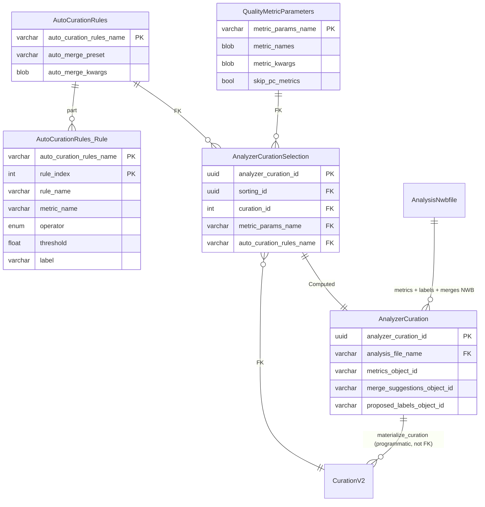
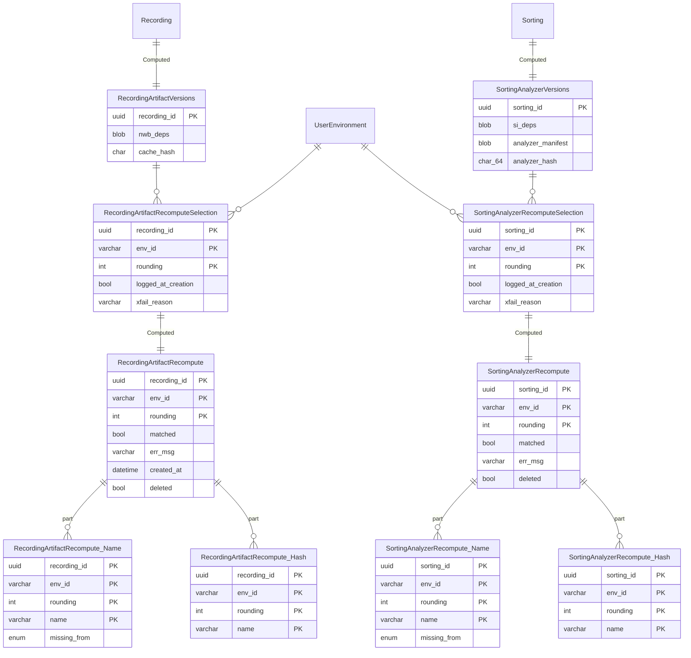
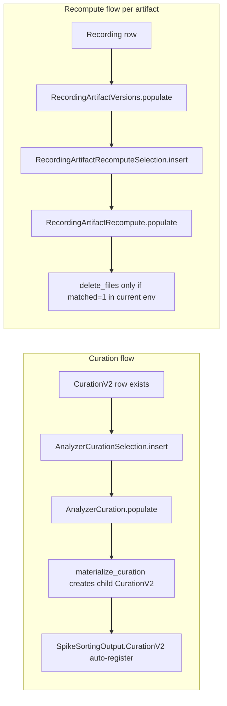

# Phase 2 — Analyzer curation + recompute verification

[← Phase 1](01-phase-1.md) · [README](README.md) · [next: Phase 3 →](03-phase-3.md)

Adds quality metrics, auto-curation, burst-pair detection (consolidated into one table), and the recompute machinery that powers verified storage reclamation. **No Phase 1 schemas change.**

## What ships in Phase 2

| New table | Tier | Purpose |
| --- | --- | --- |
| `QualityMetricParameters` | Lookup | Metric names + per-metric kwargs; SI 0.104 `compute_quality_metrics`. |
| `AutoCurationRules` | Lookup | Label thresholds + auto-merge preset name. |
| `AnalyzerCurationSelection` | Manual | One row per (curation, metrics params, rules) tuple. |
| `AnalyzerCuration` | Computed | Walks SortingAnalyzer extensions; writes metrics + merge suggestions + proposed labels to NWB. Replaces v1 `MetricCuration` + `BurstPair`. |
| `RecordingArtifactVersions` | Computed | Inventories the NWB / SI versions used to materialize each `Recording`. |
| `RecordingArtifactRecomputeSelection` | Manual | Pair (`Recording`, `UserEnvironment`) for recompute attempt. |
| `RecordingArtifactRecompute` (+ `Name`, `Hash` parts) | Computed | Compares regenerated artifact byte-hash to stored `cache_hash`. Gates `delete_files()`. |
| `SortingAnalyzerVersions` | Computed | Same shape for `Sorting`'s analyzer folder. |
| `SortingAnalyzerRecomputeSelection` | Manual | Selection row for analyzer recompute. |
| `SortingAnalyzerRecompute` (+ `Name`, `Hash` parts) | Computed | Verified analyzer folder regeneration. |

## ER diagram — analyzer curation

## ER diagram — recompute machinery

## Populate flow

## Critical design points

- **One table replaces two**: `AnalyzerCuration` consolidates v1's `MetricCuration` + `BurstPair`. The burst-pair cross-correlogram-asymmetry logic becomes one auto-merge preset; the visualization helpers (`plot_correlograms_by_sort_group`, `investigate_pair_xcorrel`, `investigate_pair_peaks`, `plot_peak_over_time`) become methods on `AnalyzerCuration`.
- **`materialize_curation()` is explicit** — auto-curation never silently writes a new `CurationV2` row. The user calls `AnalyzerCuration.materialize_curation(key)` to commit, which inserts a child `CurationV2` row with `parent_curation_id` set and `metrics_source='analyzer_curation'`.
- **Fetch-helper parity**: `AnalyzerCuration` exposes `get_waveforms`, `get_metrics`, `get_labels`, `get_merge_groups` to match v1's `MetricCuration` notebook surface.
- **NaN sanitization**: serialized metric tables coerce non-finite values to `None` in the JSON-bound path; in-memory DataFrames preserve NaN semantics (issue #1556).
- **Two distinct recompute families**: `RecordingArtifactRecompute*` verifies the NWB `ElectricalSeries` byte-hash; `SortingAnalyzerRecompute*` verifies the analyzer folder contents. Same lifecycle, different artifacts.
- **`delete_files()` gates on `matched=1` in the current `UserEnvironment`** — storage reclamation requires a verified recompute round-trip in the environment doing the deletion. Historic matches from stale environments are audit evidence only unless explicitly force-overridden with justification. `matched=0` cannot delete.
- **Admin surface**: `attempt_all`, `remove_matched`, `with_names`, `get_parent_key`, `recheck`, `get_disk_space`, `update_secondary` are preserved from v1's `RecordingRecompute` family, or explicitly listed as non-parity in [feature-parity.md](../feature-parity.md).
