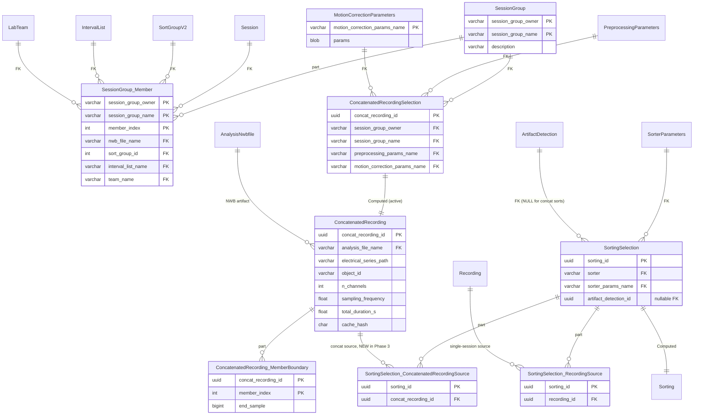
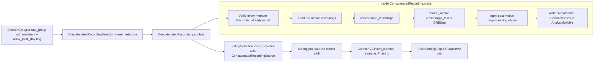

# Phase 3 — Same-day chronic concatenation

[← Phase 2](02-phase-2.md) · [README](README.md) · [next: Phase 4 →](04-phase-4.md)

**No new tables in Phase 3.** The schema declared in Phase 1 (`SessionGroup`, `MotionCorrectionParameters`, `ConcatenatedRecordingSelection`, `ConcatenatedRecording`) becomes populate-runnable. Phase 3 is method-body-only edits, per the zero-migration policy.

## What activates in Phase 3

| Phase 1 declaration | Phase 3 change |
| --- | --- |
| `ConcatenatedRecording.make()` raised `NotImplementedError` | Body fills in: reuses cached pre-motion `Recording` per member, concatenates, applies motion correction (`rigid_fast` default; DREDge opt-in), applies post-motion preprocessing (whiten), materializes one NWB-resident concatenated `ElectricalSeries`. |
| `SessionGroup.create_group()` accepted multi-day members silently | Now raises `ValueError` unless `allow_multi_day=True`. Multi-day requires an explicit (non-`auto`) motion-correction preset. |
| `SortingSelection.insert_selection()` rejected `ConcatenatedRecordingSource` with `NotImplementedError` | Now accepts. Still rejects concat + `artifact_detection_id` (concat-wide artifact masking is out of scope). |

## ER diagram — same as Phase 1 forward-compat, now active

## Populate flow

## Critical design points

- **Multi-day is opt-in, not the recommended default.** `create_group(..., allow_multi_day=True)` is required when members span two or more dates derived from `Session.session_start_time`. Default rejects with a pointer to Phase 4 sort-then-match (UnitMatch).
- **No auto-DREDge dispatch.** `MotionCorrectionParameters.preset='auto'` resolves to `rigid_fast` for single-day groups and **raises** on multi-day groups — the caller must pick an explicit `dredge_fast` / `dredge` / etc.
- **Recording cache reuse.** `ConcatenatedRecording.make()` reads from already-populated per-member `Recording` rows, not from raw NWB. Preprocessing runs once per member.
- **Pre-motion vs post-motion split.** `Recording.make()` materializes filter + CMR only. Whitening (the post-motion stage of `PreprocessingParamsSchema`) is applied:
  - Single-session path: lazily by `Sorting.make()`.
  - Concat path: by `ConcatenatedRecording.make()` AFTER motion correction.
  This guarantees motion estimators see un-whitened traces (per SI docs).
- **Anchor NWB rule.** `ConcatenatedRecording`'s `AnalysisNwbfile` parent is the **first** `SessionGroup.Member.nwb_file_name` (ordered by `member_index`). Same rule applies to concat-sort `Sorting` rows.
- **SessionGroup names are owner-scoped.** The `session_group_owner` projected `LabTeam` FK is part of the master PK, so two teams can both create `session_group_name="day1"` without colliding. Per-member `team_name` remains on `SessionGroup.Member` for collaborations that mix teams.
- **Concat sorts skip artifact masking.** `SortingSelection.insert_selection()` rejects `ConcatenatedRecordingSource` together with `artifact_detection_id`. Cross-recording artifact masking is out of scope.
- **Segment boundaries persisted.** `ConcatenatedRecording.MemberBoundary` rows hold cumulative end-sample counts so downstream code can back-map spike times to per-session sortings via `ConcatenatedRecording.split_sorting_by_session()`.
- **`Sorting.Unit` anchor rule for concat.** A unit's peak `electrode_id` maps to N `Electrode` rows (one per `SessionGroup.Member`). v2 anchors concat `Sorting.Unit` and `CurationV2.Unit` rows to the FIRST member's `Electrode`. Phase 4 sort-then-match brain-region tracing uses each pinned `CurationV2.Unit -> Electrode -> BrainRegion` path directly; if a future workflow matches concat curations, the concat anchor rule still applies unless a per-member accessor explicitly expands through `ConcatenatedRecording -> SessionGroup.Member`.

## What downstream consumers see

- `SortedSpikesGroup`, decoding, ripple, MUA continue to consume `SpikeSortingOutput.merge_id` — concat sorts are indistinguishable at that surface.
- `CurationV2.get_unit_brain_regions()` on a concat sort raises `ConcatBrainRegionAmbiguousError` by default. Callers can opt into anchor-member output with `allow_anchor_member=True`, which marks rows with `region_resolution="anchor_member"`. Multi-member region tracing requires the Phase 4 cross-session accessor.
