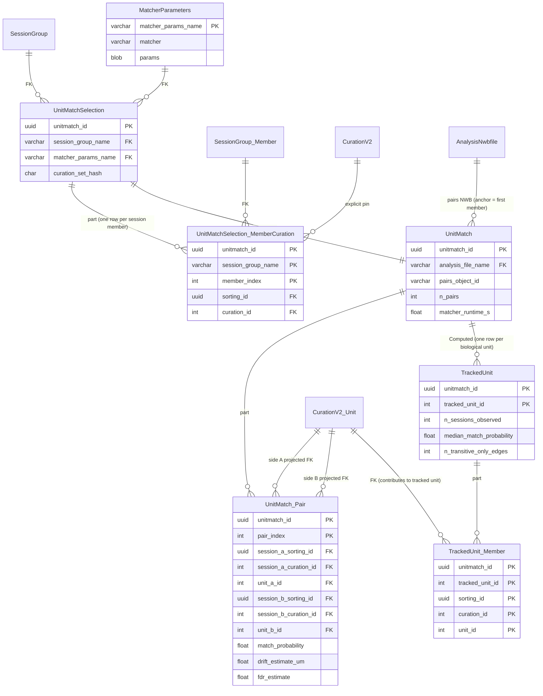
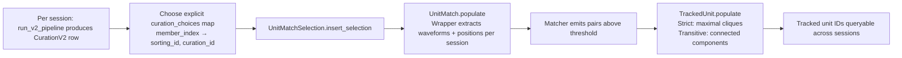

# Phase 4 — Cross-session unit matching

[← Phase 3](03-phase-3.md) · [README](README.md) · [next: Phase 5 →](05-phase-5.md)

Sort-then-match workflow: independently sort each session, then identify the same biological unit across sessions via UnitMatchPy (or a future DeepUnitMatch plugin). The matcher backend is pluggable; the schema is matcher-agnostic.

## What ships in Phase 4

| New table | Tier | Purpose |
| --- | --- | --- |
| `MatcherParameters` | Lookup | Per-matcher params (`unitmatch_default`, etc.). Validated against per-matcher Pydantic schema. |
| `UnitMatchSelection` (+ `MemberCuration` part) | Manual | One row per (SessionGroup, MatcherParameters, **explicit per-member curation pin**) tuple. Refuses implicit "latest curation" lookups. |
| `UnitMatch` (+ `Pair` part) | Computed | Runs the matcher; writes pairwise match probabilities to NWB. Pair part has projected FKs to both sides as `CurationV2.Unit`. |
| `TrackedUnit` (+ `Member` part) | Computed | Derives biological-unit identity across sessions via maximal cliques (strict mode) or connected components (transitive mode) over thresholded match pairs. |

## ER diagram



## Populate flow



## Critical design points

- **No implicit "latest curation" lookup.** `UnitMatchSelection.MemberCuration` requires the caller to pin one `(sorting_id, curation_id)` per `SessionGroup.Member`. Adding a new curation to one of the source sessions does NOT invalidate or auto-update an existing `UnitMatch` row.
- **`curation_set_hash` on the master row** is a sha256 over the ordered member→curation choices. Makes `insert_selection()` idempotent under the shared contract; two calls with the same pinning return the same `unitmatch_id`.
- **Wrapper-owned matcher input.** The v2 wrapper extracts per-unit waveforms + channel positions from each curated SortingAnalyzer and writes them to a matcher-specific on-disk layout in a per-session bundle dir. The matcher consumes the bundle; it never touches raw NWB paths, Spyglass table keys, or `si.SortingAnalyzer` objects directly.
- **Matchable unit filtering.** `CurationV2.get_matchable_unit_ids(key, exclude_labels={"reject","noise","artifact"})` returns curated units with no excluded labels. Unlabeled units and units labeled only `accept` / `mua` are included.
- **Projected FK on `UnitMatch.Pair`**: each side projects `CurationV2.Unit` → `(session_X_sorting_id, session_X_curation_id, unit_X_id)`. DataJoint enforces referential integrity — a pair cannot reference a unit that doesn't exist in the pinned curation.
- **Singletons survive.** `TrackedUnit.make()` seeds the graph with the **full curated-unit universe** (every pinned curation's matchable units), not just nodes that appear in pair records. A unit the matcher emitted no pair for becomes a singleton `TrackedUnit` with `n_sessions_observed=1` and `median_match_probability=NULL`.
- **Strict-by-default policy.** A tracked unit requires **every pairwise edge in its node set** to exceed threshold (maximal cliques). The transitive fallback is opt-in via `MatcherParameters.params["tracked_unit_policy"]="transitive"`, and the count of transitive-only edges per component is reported.
- **Anchor NWB rule.** `UnitMatch.AnalysisNwbfile` parent is the first `SessionGroup.Member.nwb_file_name`. Cross-session provenance lives in `UnitMatchSelection.MemberCuration`, not the anchor NWB's metadata.

## Brain-region tracing for tracked units

```
TrackedUnit.Member
  → CurationV2.Unit             (the curated unit on its session)
  → Electrode                   (peak channel FK stored on CurationV2.Unit)
  → BrainRegion                 (region_name)
```

A unit may map to different brain regions in different sessions if the probe re-anatomized (rare but possible across days). `TrackedUnit.get_unit_brain_regions(key)` returns per-session region for each contributing member by following the pinned `CurationV2.Unit` rows. The `UnitMatchSelection.MemberCuration -> SessionGroup.Member` path is used to validate member ownership/provenance, not to discover the unit's peak-channel region.

## What's intentionally NOT in this phase

- **DeepUnitMatch.** Plugged into the `MatcherProtocol` slot as a future entry; not implemented here.
- **Cross-probe matching.** UnitMatch assumes one probe across sessions in a group.
- **A FigPack curation surface for `TrackedUnit`.** Phase 5 ships `FigPackCuration` for single-session curation only.
