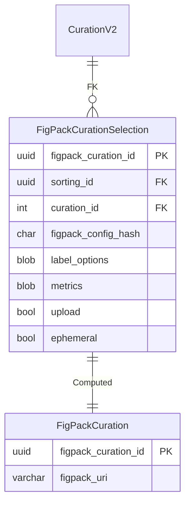
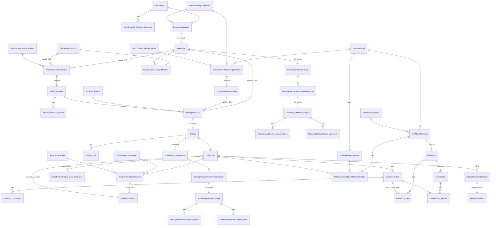

# Phase 5 — FigPack curation UI + UX overhaul

[← Phase 4](04-phase-4.md) · [README](README.md)

The capstone phase. Adds the FigPack curation UI (replacing FigURL for v2), extends the `run_v2_pipeline()` orchestrator with metrics / concat / FigPack, and adds the separate `run_v2_unit_match()` helper. The orchestrators are Python functions, not tables — only the FigPack pair below is a new schema addition.

## What ships in Phase 5

| New table | Tier | Purpose |
| --- | --- | --- |
| `FigPackCurationSelection` | Manual | One row per (curation, UI config) tuple. Selection identity includes `figpack_config_hash` so repeat calls with different label options / metrics are distinct rows. |
| `FigPackCuration` | Computed | Builds the FigPack view from `Sorting`'s SortingAnalyzer; uploads / publishes; stores returned URI. |

**No table changes to Phases 1–4.** The orchestrator helpers (`run_v2_pipeline()`, `run_v2_unit_match()`) live in `pipeline.py` and don't introduce schemas.

## ER diagram

## Full v2 surface (cumulative)

## Orchestrator surface (Python only)

```mermaid
flowchart TB
    subgraph "Single-session OR same-day concat"
        P[run_v2_pipeline]
        P -- "if nwb_file_name / sort_group_id / interval_list_name set" --> S[Single-session path]
        P -- "if concat_session_group_owner + name set" --> C[Concat path]
        S --> R1[Recording.populate]
        C --> R2[ConcatenatedRecording.populate]
        R1 --> A[ArtifactDetection if not skip_artifact]
        A --> SO[Sorting.populate]
        R2 --> SO
        SO --> CU[CurationV2.insert_curation]
        CU --> AC[AnalyzerCuration if auto_curate=True]
        AC --> M[materialize_curation, child CurationV2]
        M --> FP[FigPackCuration if figpack=True]
        FP --> O[Return manifest dict with merge_id]
    end

    subgraph "Cross-session matching (SEPARATE helper)"
        UM[run_v2_unit_match]
        UM -- "requires explicit curation_choices" --> UMS[UnitMatchSelection.insert_selection]
        UMS --> UMP[UnitMatch.populate]
        UMP --> TU[TrackedUnit.populate]
        TU --> O2[Return manifest dict with unitmatch_id]
    end
```

## Critical design points

- **FigPack feasibility check FIRST.** Phase 5 begins with an explicit upstream-API verification step before any DataJoint code is written. If FigPack proves unusable, Phase 5 stops and escalates — the plan does NOT silently fall back to FigURL.
- **Selection-row identity includes the UI config.** `FigPackCurationSelection.figpack_config_hash` is a sha256 over `label_options + metrics + upload + ephemeral`. Two different UI configs for the same curation produce two distinct selection rows. v1's `FigURLCurationSelection` lacked this — repeat calls with different options collided.
- **Default `label_options` use v2 enum labels** (`["mua", "accept", "noise"]`), not FigURL-era `"good"`.
- **Spyglass-owned adapter helpers** wrap the verified FigPack API. `_build_figpack_curation_view()` and `_show_or_upload_figpack_view()` are private adapters; the upstream API is pinned only after the feasibility check.
- **Workflow separation.** `run_v2_pipeline(concat_session_group_owner=..., concat_session_group_name=...)` runs a concatenated sort. `run_v2_unit_match(session_group_owner=..., session_group_name=..., curation_choices=...)` is a separate function for sort-then-match. The two cannot be confused via overlapping parameters.
- **`run_v2_unit_match` requires explicit curation choices.** Calling without `curation_choices` raises; the function never auto-pins "latest" curations.
- **Idempotent orchestrators.** Both helpers return manifest dicts of every `(stage, key)` they touched. Repeat calls with identical args find the same selection rows and return the same manifest — no duplicate inserts.
- **No v1/v0 schema changes.** `git diff src/spyglass/spikesorting/{v0,v1}/` is empty after the Phase 5 PR.

## Final cumulative state

Phase 5 leaves v2 with:

- 13 v2 Manual tables: 9 selection-style drivers (`RecordingSelection`, `ArtifactDetectionSelection`, `SortingSelection`, `ConcatenatedRecordingSelection`, `AnalyzerCurationSelection`, `RecordingArtifactRecomputeSelection`, `SortingAnalyzerRecomputeSelection`, `UnitMatchSelection`, `FigPackCurationSelection`) plus `SortGroupV2`, `SharedArtifactGroup`, `CurationV2`, and `SessionGroup`.
- 12 Computed tables: `Recording`, `ArtifactDetection`, `ConcatenatedRecording`, `Sorting`, `AnalyzerCuration`, `RecordingArtifactVersions`, `RecordingArtifactRecompute`, `SortingAnalyzerVersions`, `SortingAnalyzerRecompute`, `UnitMatch`, `TrackedUnit`, and `FigPackCuration`.
- 14 v2 part tables: sort-group electrodes, shared-artifact members, artifact intervals, sorting units, curation units + labels, session-group members, UnitMatch member curations + pair records, tracked-unit members, and Name/Hash parts for both recompute families.
- 7 Lookup tables: preprocessing, artifact, sorter, motion-correction, quality-metric, auto-curation-rule, and matcher parameters.
- Recompute subsystem: 10 tables total across two families — 2 Versions + 2 Selection + 2 Result + 4 part tables (`Name`/`Hash` × recording artifact and sorting analyzer).
- 1 new merge-master part (`SpikeSortingOutput.CurationV2`)
- 2 Python orchestrator functions (`run_v2_pipeline`, `run_v2_unit_match`)

v0 and v1 stay in-tree, untouched, indefinitely.
