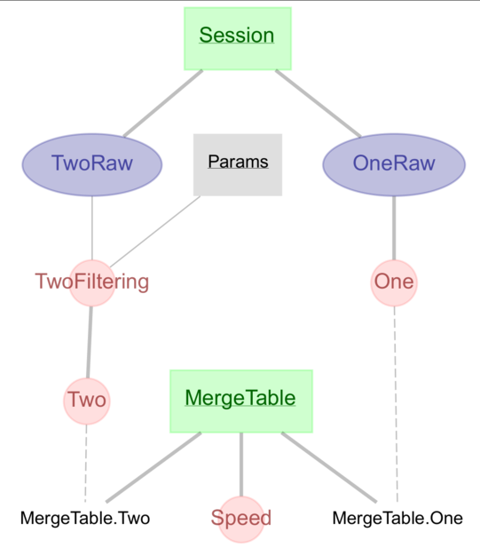

# Merge Tables

## Why

A pipeline may diverge when we want to process the same data in different ways.
Merge Tables allow us to join divergent pipelines together, and unify downstream
processing steps. For a more in depth discussion, please refer to
[this notebook](https://github.com/ttngu207/db-programming-with-datajoint/blob/master/notebooks/pipelines_merging_design_master_part.ipynb)
and related discussions
[here](https://github.com/datajoint/datajoint-python/issues/151) and
[here](https://github.com/LorenFrankLab/spyglass/issues/469).

## What

A Merge Table is fundamentally a master table with one part for each divergent
pipeline. By convention...

1. The master table has one primary key, `merge_id`, a
    [UUID](https://en.wikipedia.org/wiki/Universally_unique_identifier), and
    one secondary attribute, `source`, which gives the part table name. Both
    are managed with the custom `insert` function of this class.

2. Each part table has inherits the final table in its respective pipeline, and
    shares the same name as this table.

```python
from spyglass.utils.dj_merge_tables import _Merge


@schema
class MergeOutput(_Merge):
    definition = """
    merge_id: uuid
    ---
    source: varchar(32)
    """

    class One(dj.Part):
        definition = """
        -> master
        ---
        -> One
        """

    class Two(dj.Part):
        definition = """
        -> master
        ---
        -> Two
        """
```



By convention, Merge Tables have been named with the pipeline name plus `Output`
(e.g., `LFPOutput`, `PositionOutput`). Using the underscore alias for this class
allows us to circumvent a DataJoint protection that interprets the class as a
table itself.

## How

### Merging

The Merge class in Spyglass's utils is a subclass of DataJoint's
[Manual Table](https://datajoint.com/docs/core/design/tables/tiers/#data-entry-lookup-and-manual)
and adds functions to make the awkwardness of part tables more manageable. These
functions are described in the [API section](../api/utils/dj_merge_tables.md),
under `utils.dj_merge_tables`.

### Restricting

In short: restrict Merge Tables with arguments, not the `&` operator.

- Normally: `Table & "field='value'"`
- Instead: `MergeTable.merge_view(restriction="field='value'"`).

_Caution_. The `&` operator may look like it's working when using `dict`, but
this is because invalid keys will be ignored. `Master & {'part_field':'value'}`
is equivalent to `Master` alone
([source](https://docs.datajoint.org/python/queries/06-Restriction.html#restriction-by-a-mapping)).

When provided as arguments, methods like `merge_get_part` and `merge_get_parent`
will override the permissive treatment of mappings described above to only
return relevant tables.

### Building Downstream

A downstream analysis will ideally be able to use all diverget pipelines
interchangeably. If there are parameters that may be required for downstream
processing, they should be included in the final table of the pipeline. In the
example above, both `One` and `Two` might have a secondary key `params`. A
downstream Computed table could do the following:

```python
def make(self, key):
    try:
        params = MergeTable.merge_get_parent(restriction=key).fetch("params")
    except DataJointError:
        params = default_params
    processed_data = self.processing_func(key, params)
```

Note that the `try/except` above catches a possible error in the event `params`
is not present in the parent.

## Example

For example usage, see our Merge Table notebook.
