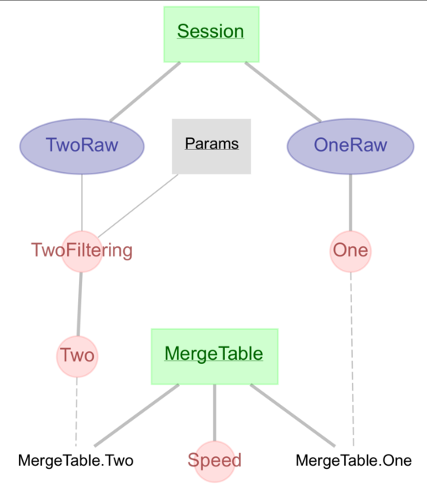

# Merge Tables

## Why

A pipeline may diverge when we want to process the same data in different ways.
Merge Tables allow us to join divergent pipelines together, and unify downstream
processing steps. For a more in depth discussion, please refer to
[this notebook](https://github.com/ttngu207/db-programming-with-datajoint/blob/master/notebooks/pipelines_merging_design_master_part.ipynb)
and related discussions
[here](https://github.com/datajoint/datajoint-python/issues/151) and
[here](https://github.com/LorenFrankLab/spyglass/issues/469).

## What

A Merge Table is fundamentally a master table with one part for each divergent
pipeline. By convention...

1. The master table has one primary key, `merge_id`, a
    [UUID](https://en.wikipedia.org/wiki/Universally_unique_identifier), and
    one secondary attribute, `source`, which gives the part table name. Both
    are managed with the custom `insert` function of this class.

2. Each part table has inherits the final table in its respective pipeline, and
    shares the same name as this table.

```python
from spyglass.utils.dj_merge_tables import _Merge


@schema
class MergeOutput(_Merge):
    definition = """
    merge_id: uuid
    ---
    source: varchar(32)
    """

    class One(dj.Part):
        definition = """
        -> master
        ---
        -> One
        """

    class Two(dj.Part):
        definition = """
        -> master
        ---
        -> Two
        """
```



By convention, Merge Tables have been named with the pipeline name plus `Output`
(e.g., `LFPOutput`, `PositionOutput`). Using the underscore alias for this class
allows us to circumvent a DataJoint protection that interprets the class as a
table itself.

## How

### Merging

The Merge class in Spyglass's utils is a subclass of DataJoint's
[Manual Table](https://datajoint.com/docs/core/design/tables/tiers/#data-entry-lookup-and-manual)
and adds functions to make the awkwardness of part tables more manageable. These
functions are described in the [API section](../api/utils/dj_merge_tables.md),
under `utils.dj_merge_tables`.

### Restricting

Restrict a Merge Table with the standard `&` operator. Part-table fields are
resolved automatically:

```python
# Restrict by a field that lives in a part table — works correctly
result = MergeTable & {"nwb_file_name": "my_session.nwb"}
len(result)  # only rows whose part has nwb_file_name == "my_session.nwb"

# Restrict by the master primary key — unchanged behavior
result = MergeTable & {"merge_id": some_uuid}
```

!!! note "String restrictions"

    Both dict and string restrictions resolve through parts automatically when the
    restriction references a part-table field name:

    ```python
    # These are equivalent:
    MergeTable & {"nwb_file_name": "session.nwb"}
    MergeTable & 'nwb_file_name LIKE "session%"'
    ```

    String restrictions on master-only fields (`merge_id`, `source`) are passed
    through to DataJoint directly without part-table resolution.

!!! note "Raw master-only restriction"

    If you intentionally want to restrict on `merge_id` or `source` without
    part-table resolution, use `super_restrict()`:

    ```python
    MergeTable.super_restrict({"source": "MyPart"})
    ```

### Fetching

`fetch()` and `fetch1()` on a (restricted) Merge Table walk the part tables
automatically:

```python
# Fetch a part-table attribute — walks parts
(MergeTable & restriction).fetch("nwb_file_name")

# fetch1() — exactly one row; returns dict / scalar / tuple per DJ convention
(MergeTable & restriction).fetch1()  # dict of all columns
(MergeTable & restriction).fetch1("nwb_file_name")  # scalar
(MergeTable & restriction).fetch1("a", "b")  # tuple

# Fetch master-only columns — served from master directly
MergeTable.fetch("merge_id")
MergeTable.fetch("source")

# Raw master-only fetch (bypasses part-walking)
MergeTable.super_fetch()
```

### Viewing

```python
# Print a merged union of all parts
(MergeTable & restriction).view()

# Return an HTML representation (notebooks)
(MergeTable & restriction).html()
```

### Selecting part and parent tables

```python
# Get the part table matching the current restriction
(MergeTable & restriction).get_part_table()

# Get the part table joined with master (includes source column)
(MergeTable & restriction).get_part_table(join_master=True)

# Get the upstream parent table (the source of the data)
(MergeTable & restriction).get_parent_table()
```

### Deleting

```python
# Delete merge entries (master + parts) matching the restriction
(MergeTable & restriction).delete()

# Delete the upstream parent-table entries (destructive!)
(MergeTable & restriction).delete_upstream(dry_run=True)  # preview
(MergeTable & restriction).delete_upstream(dry_run=False)  # execute
```

### Building Downstream

A downstream analysis will ideally be able to use all divergent pipelines
interchangeably. If there are parameters that may be required for downstream
processing, they should be included in the final table of the pipeline. In the
example above, both `One` and `Two` might have a secondary key `params`. A
downstream Computed table could do the following:

```python
def make(self, key):
    try:
        params = (MergeTable & key).get_parent_table().fetch("params")
    except DataJointError:
        params = default_params
    processed_data = self.processing_func(key, params)
```

## Deprecated API

The following class methods are deprecated and will be removed in Spyglass
0.7.0. They continue to work but emit a deprecation warning on first call.
Migrate to the instance-method equivalents shown in the table below.

| Deprecated call                                             | Replacement                                                |
| ----------------------------------------------------------- | ---------------------------------------------------------- |
| `MergeTable.merge_view(restriction)`                        | `(MergeTable & restriction).view()`                        |
| `MergeTable.merge_html(restriction)`                        | `(MergeTable & restriction).html()`                        |
| `MergeTable.merge_restrict(restriction)`                    | `MergeTable & restriction`                                 |
| `MergeTable.merge_delete(restriction)`                      | `(MergeTable & restriction).delete()`                      |
| `MergeTable.merge_delete_parent(restriction, dry_run=True)` | `(MergeTable & restriction).delete_upstream(dry_run=True)` |
| `MergeTable.merge_get_part(restriction, ...)`               | `(MergeTable & restriction).get_part_table(...)`           |
| `MergeTable.merge_get_parent(restriction, ...)`             | `(MergeTable & restriction).get_parent_table(...)`         |
| `MergeTable.merge_fetch(restriction, *attrs)`               | `(MergeTable & restriction).fetch(*attrs)`                 |
| `MergeTable.merge_populate(source, keys)`                   | `MergeTable.populate(source, keys)`                        |

## Example

For example usage, see our Merge Table notebook.
