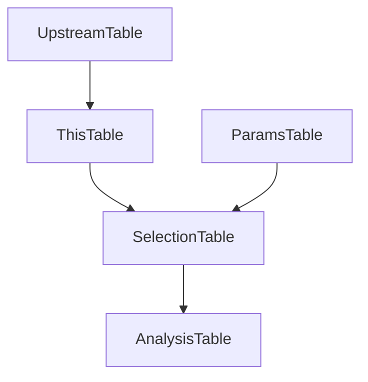

# Schema Design

- This document gives an overview of translating an analysis into a custom
    DataJoint schema in line with norms established in Spyglass.
- It builds on other Spyglass documentation, and assumes you have a basic
    understanding of DataJoint syntax. See ...
    - [Pipeline Overview](https://datajoint.com/docs/core/datajoint-python/latest/quick-start/)
    - [Table Types](https://lorenfranklab.github.io/spyglass/latest/ForDevelopers/TableTypes/)
    - [Understanding a Schema](https://lorenfranklab.github.io/spyglass/latest/ForDevelopers/Schema/)
    - [Merge Tables](https://lorenfranklab.github.io/spyglass/latest/Features/Merge/)

## Analysis Structure

However your analysis is currently organized, there are several conceptual
pieces to consider splitting off into separate tables.

- **Parameters**: Key-value pairs that define the analysis.
- **Data**: Input data might be raw or processed by another pipeline.
- **Selection**: A staging ground for pairing parameters and data.
- **Analysis**: The core analysis, which processes input data with the
    corresponding parameters into results.

### Parameters

Parameters are any key-value pairs that define an analysis. They might the
argument and value pairs of a function call (e.g., zscore threshold), or the
analysis method applied (e.g., one spikesorter vs. another). A given pipeline
might have multiple parameter tables, each collecting key-value pairs for
different aspects of the analysis.

A choice to make is whether to use explicit fields or a `blob` field for
arbitrary data. Fields are more readable and searchable down the line, allowing
you to easily select a subset of analyses based on a single parameter (i.e.,
`MyAnalysis * MyParams & "param_name='example1'"`). The insertion process serves
as data validation, ensuring that each parameter is of the correct type.
Depending on the analysis, this can lead to a lot of fields and may not be
flexible to external dependency changes[^1].

Alternatively, a `blob`[^2] field will accept any arbitrary data, including a
python dictionary of your various parameters. This trades of the readability,
searchability, and validation of explicit fields for flexibility.

Example parameter table using one explicit and one `blob` field:

```python
@schema
class MyParams(SpyglassMixin, dj.Lookup):
    definition = """
    param_name     : varchar(32) # name of paramset
    ---
    specific=NULL  : int         # specific validated value
    all_others     : blob        # catch-all for other values
    """
    contents = [  # Contents inserted on declaration
        ["example1", 0, {"A": 1, "B": 2}],
        ["example2", 1, {"A": 3, "B": 4}],
    ]
```

### Data

The input data table for your analysis might just be a direct connection to an
existing foreign key referenced in your [Selection](#selection) table.

Alternatively, your pipeline might call for some deterministic preprocessing,
including blinding, or reformatting of the data. Anything more than a simple
preprocessing step should be separated into a different paramerterized Selection
table.

Example simple preprocessing step:

```python
@schema
class SubjBlinded(SpyglassMixin, dj.Manual):  # Or dj.Computed
    """Blinded subject table, simple preprocessing step."""

    definition = """
    subject_id: uuid # id
    ---
    -> Subject.proj(actual_id='subject_id') # aliasing a foreign key
    """

    def insert(self, key):
        """Insert data with blinded subject IDs."""
        self.insert1({"subject_id": uuid.uuid4(), actual_id: key["subject_id"]})
```

A decision point at this stage is the unit of analysis, or the minimum
granularity of data that can be analyzed. This often matches the unit of some
upstream table (e.g., behavioral epoch, spike sorting curation), calling for a
direct link to that table (either in a preprocessing step or in the Selection
table). Alternatively, the unit of analysis might be a grouping of multiple
upstream units (e.g., electrodes[^3]). In this case, you can use `dj.Part`
tables to create a many-to-one relationship between the upstream data and your
analysis.

Example grouping of upstream data:

```python
@schema
class MyGrouping(SpyglassMixin, dj.Manual):  # many-to-one
    definition = """
    group_id: int
    """

    class MyUnit(SpyglassMixinPart):
        definition = """
        -> MyGrouping
        -> UpstreamUnit
        """
```

### Selection

A `Selection` table can be used to filter the upstream data, as a staging table
for analysis, or as a way to selectively pair parameters with relevant data.
Helper functions like `insert_default` can be used to insert all upstream items
of one foreign key reference with a given key of another.

```python
@schema
class MyAnalysisSelection(SpyglassMixin, dj.Manual):
    definition = """
    -> SubjBlinded
    -> MyParams
    """

    def insert_default(self, params_name="default"):
        """Insert all available subjects with given params."""
        all_subjects = SubjBlided.fetch("KEY", as_dict=True)
        self.insert([{**key, "params_name": params_name} for key in all_subjects])
```

If you expect that you will always want to process all combinations of upstream
data, a `Selection` table is not necessary.

### Analysis

The analysis table is the core of your pipeline, featuring the `make` method
that takes all relevant upstream data and parameters, and produces results. At
runtime `.populate()` will run all available combinations of upstream foreign
keys, executing the `make` method for each combination.

By convention, Spyglass tables store metadata and all results are stored as
entries in `AnalysisNwbfile`, with corresponding NWB files on disk. See existing
tables for examples of how to create and store NWB files. In the event that some
downstream analysis is selective to an analysis result, you might add a `result`
field to the analysis table, and store various results associated with that
analysis in a part table.

Example analysis table:

```python
@schema
class MyAnalysis(SpyglassMixin, dj.Computed):
    definition = """
    -> MyAnalysisSelection
    ---
    -> AnalysisNwbfile
    -> IntervalList
    """

    class MyAnalysisPart(SpyglassMixin, dj.Part):
        """Part table for storing queryable analysis results."""

        definition = """
        -> MyAnalysis
        id: int
        ---
        result: int
        """

    def make(self, key):
        # 1. Collect inputs
        params = (MyParams & key).fetch1("params")
        data = (MyAnalysisSelection & key).fetch_data()
        # 2. Run analysis
        ...
        interval = (IntervalList & key).fetch_interval()
        interval = interval.intersect(params["valid_times"])
        interval.name = my_new_name
        analysis_file_name = AnalysisNwbfile.create(key, data)
        # 3. Insert results
        IntervalList.insert1(interval.as_dict)
        self.insert1(
            {
                **key,
                **interval.primary_key
                "analysis_file_name": analysis_file_name,
            }
        )
        self.MyAnalysisPart.insert1({**key, "result": 1})
```

In general, `make` methods have three steps:

1. Collect inputs: fetch the relevant parameters and data.
2. Run analysis: run the analysis on the inputs.
3. Insert results: insert the results into the relevant tables.

DataJoint has protections in place to ensure that `populate` calls are treated
as a single transaction, but separating these steps supports debugging and
testing.

To facilitate operations on the time intervals, the `IntervalList` table has a
`fetch_interval` method that returns the relevant `valid_times` as an `Interval`
object, with associated methods for manipulating intervals (e.g., `union`,
`intersect`, `contains`, etc.). For a full list op methods, see
[api documentation](https://lorenfranklab.github.io/spyglass/latest/api/common/common_interval/#spyglass.common.common_interval.Interval).

## Primary and Foreign Key References

Primary vs Secondary and Foreign Key vs Field are orthogonal concepts that can
be confusing when designing a schema and deciding how to reference upstream
tables.

- A primary field is a unique identifier for that table.
    - One or more fields can be combined to form a primary key.
    - Foreign-key referencing (fk-ref'ing) a table adds all primary key fields of
        the upstream table to the downstream table, regardless of whether the
        reference is part of the downstream table's primary key.
- A secondary field is arbitrary data associated with the primary key.
- A foreign primary key is likely another processing step for that data.
- A foreign secondary key is likely other data associated with that primary key,
    like `AnalysisNwbfile`.

### Foreign Primary Key

#### Single

As the sole primary key, a fk-ref indicates a one-to-one relationship. This is
often another processing step for that data, but likely should be replaced with
the next approach.

```python
definition = """
-> UpstreamTable
---
anything: varchar(32)
"""
```

To explain why this is not the best approach, consider the following example.



It could be the case that `ThisTable` represents a conceptually different step
than `SelectionTable`, and should be separated out, but your pipeline would
likely be simplified by including this conceptual step in the selection process,
via part tables or custom table methods.
[`LFPBandSelection`](https://github.com/LorenFrankLab/spyglass/blob/794d486eec766a1e3965b3ed88996a2c486cd3a2/src/spyglass/common/common_ephys.py#L617),
for example, add has a `set_lfp_band_electrodes` helper method for input
validation and selection.

#### Multiple

A fk-ref as one of multiple fk-ref'ed primary keys indicates pairing of upstream
data. The primary key of the following table is a combination of the primary key
of `UpstreamTable1` and `UpstreamTable2`, like input data and parameters.

```python
definition = """
-> UpstreamTable1
-> UpstreamTable2
"""
```

This is common for a `Selection` table, like
[`IntervalPositionInfoSelection`](https://github.com/LorenFrankLab/spyglass/blob/794d486eec766a1e3965b3ed88996a2c486cd3a2/src/spyglass/common/common_position.py#L63-L71),
combining position parameters with a given set of position data via a time
window. This is also common for part tables that fk-ref an upstream data source
in addition to fk-ref'ing their master, like
[`LFPElectrode`](https://github.com/LorenFrankLab/spyglass/blob/794d486eec766a1e3965b3ed88996a2c486cd3a2/src/spyglass/lfp/lfp_electrode.py#L18-L22).

#### With Other Fields

A fk-ref as a primary key with other fields indicates a many-to-one
relationship. This is rare in an analysis pipeline, as it is often better to
separate this into a parameter table.

```python
definition = """
-> UpstreamTable1
other_field: varchar(32)
"""
```

This is appropriate, however, for a table, like
[`CurationV1`](https://github.com/LorenFrankLab/spyglass/blob/794d486eec766a1e3965b3ed88996a2c486cd3a2/src/spyglass/spikesorting/v1/curation.py#L27-L38),
where one spike sorting may be curated multiple times, meaning the curation
process is a many-to-one relationship with the spike sorting.

### Foreign Secondary Key

#### Non-Unique

A fk-ref as a secondary key indicates a linking to non-indexed fields. This
other key does not uniquely identify the row.

```python
definition = """
-> UpstreamTable1
---
-> AnalysisNwbfile
-> [nullable] CameraDevice
"""
```

[`TaskEpoch`](https://github.com/LorenFrankLab/spyglass/blob/master/src/spyglass/common/common_task.py#L90-L102),
for example, associates a session with exactly one task conducted during that
session, and zero-or-one camera devices used during that task.

#### Aliasing

Less commonly, a secondary fk-ref may be an aliasing of the primary key(s).
MySQL has limitations on the number of fields in a primary key, so we can give a
grouping of fields a single name.

```python
definition = """
my_id: int
---
-> UpstreamTable1
-> UpstreamTable2
"""
```

### Foreign Keys in Part Tables

[Part Tables](https://datajoint.com/docs/core/datajoint-python/0.14/design/tables/master-part/)
operate on the assumption that any time there is an insert or delete on the
master, all relevant parts are also inserted or deleted. This means that part
tables are a many-to-one mapping when all parts are known at the time the master
is inserted. Any time one unit of analysis covers multiple sub-units, a part
table is appropriate. See the grouping example [above](#data).

## Using Merge Tables

Merge tables signify that an analysis can be done in multiple ways, which is
useful for pipeline versioning and allowing different analysis methods.

When attaching downstream, you can either ...

1. Assume your data comes from one path, or 'source'. If only one method is
    relevant in your analysis, you should raise an error in other cases.
2. Allow for multiple sources and let merge-specific functions handle capturing
    the relevant upstream data.

Example downstream-of-merge tables with each approach:

```python
@schema
class MyAnalysis(SpyglassMixin, dj.Computed):
    definition = """
    -> SomeMergeTable
    -> MyParams
    ---
    -> AnalysisNwbfile
    """

    def make_assume_one(self, key):
        parent = SomeMergeTable().merge_get_parent(key)
        if parent.camel_name != "MyUpstreamTable":
            raise ValueError("This analysis only works with MyUpstreamTable")
        data = (MyUpstreamTable & parent).some_method()

    def make_allow_multiple(self, key):
        data = (SomeMergeTable & key).fetch_data()
```

See
[docs](https://lorenfranklab.github.io/spyglass/latest/api/utils/dj_merge_tables/)
for more information on available methods.
[Existing tables](https://github.com/LorenFrankLab/spyglass/blob/master/src/spyglass/decoding/decoding_merge.py)
also provide a good reference. If you're taking the second approach and are
unsure about relevant methods, please open a GitHub discussion.

[^1]: For example, `externalpackage.analysis_func` renames `param_name` to
    `param_rename` in version 2.0, and adjusts the functionality to handle new
    cases. You can either (a) run an `if/then` against the package version, and
    rename the parameters in the relevant case(s), or (b) alter the table
    definition to add a new nullable secondary field `param_rename=NULL` and
    declare new paramsets for new versions of the package.

[^2]: `blob`s are MySQL-native data types, and come in
    [various sizes](https://dev.mysql.com/doc/refman/8.0/en/blob.html). For best
    results, select the smallest size that will fit your data. `tinyblob` is 255
    bytes, `blob` is 64KB, `mediumblob` is 16MB, and `longblob` is 4GB.

[^3]: See `spyglass.lfp.lfp_electrode.LFPElectrodeGroup` for an example of
    grouping electrodes into a collection.
