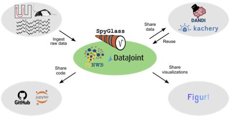

# Spyglass

**Spyglass** is an open-source software framework designed to offer reliable and
reproducible analysis of neuroscience data and sharing of the results with
collaborators and the broader community.

## Features

Features of Spyglass include:

- **Standardized data storage** - Spyglass uses the open-source
    [Neurodata Without Borders: Neurophysiology (NWB:N)](https://www.nwb.org/)
    format to ingest and store processed data. NWB:N is a standard set by the
    BRAIN Initiative for neurophysiological data
    ([Rübel et al., 2022](https://doi.org/10.7554/elife.78362)).
- **Reproducible analysis** - Spyglass uses [DataJoint](https://datajoint.com/)
    to ensure that all analysis is reproducible. DataJoint is a data management
    system that automatically tracks dependencies between data and analysis
    code. This ensures that all analysis is reproducible and that the results
    are automatically updated when the data or analysis code changes.
- **Common analysis tools** - Spyglass provides easy usage of the open-source
    packages [SpikeInterface](https://github.com/SpikeInterface/spikeinterface),
    [Ghostipy](https://github.com/kemerelab/ghostipy), and
    [DeepLabCut](https://github.com/DeepLabCut/DeepLabCut) for common analysis
    tasks. These packages are well-documented and have active developer
    communities.
- **Interactive data visualization** - Spyglass uses
    [figurl](https://github.com/flatironinstitute/figurl) to create interactive
    data visualizations that can be shared with collaborators and the broader
    community. These visualizations are hosted on the web and can be viewed in
    any modern web browser. The interactivity allows users to explore the data
    and analysis results in detail.
- **Sharing results** - Spyglass enables sharing of data and analysis results
    via [Kachery](https://github.com/flatironinstitute/kachery-cloud), a
    decentralized content addressable data sharing platform. Kachery Cloud
    allows users to access the database and pull data and analysis results
    directly to their local machine.
- **Pipeline versioning** - Processing and analysis of data in neuroscience is
    often dynamic, requiring new features. Spyglass uses *Merge tables* to
    ensure that analysis pipelines can be versioned. This allows users to easily
    use and compare results from different versions of the analysis pipeline
    while retaining the ability to access previously generated results.
- **Cautious Delete** - Spyglass uses a `cautious delete` feature to ensure that
    data is not accidentally deleted by other users. When a user deletes data,
    Spyglass will first check to see if the data belongs to another team of
    users. This enables teams of users to work collaboratively on the same
    database without worrying about accidentally deleting each other's data.

## Getting Started

This site hosts both installation instructions as part of our
[tutorials](./notebooks/index.md) to help you get started with Spyglass. We
recommend running the notebooks yourself. They can be downloaded from GitHub
[here](https://github.com/LorenFrankLab/spyglass).

## Diving Deeper

The [API Reference](./api/index.md) provides a detailed description of all the
tables and class functions in Spyglass via Python docstrings.

To highlight some of the key features of Spyglass and some features added to
DataJoint, we have a series of articles on Spyglass
[features](./Features/index.md).

Our [developer guide](./ForDevelopers/index.md) provides an overview of
development practices for either contributing to the project itself or setting
up custom pipelines for your own analysis.

Our [changelog](./CHANGELOG.md) highlights the changes that have been made to
Spyglass over time and the [copyright](./LICENSE.md) page contains license
information.

## Citing Spyglass

> Lee, K.H.\*, Denovellis, E.L.\*, Ly, R., Magland, J., Soules, J., Comrie,
> A.E., Gramling, D.P., Guidera, J.A., Nevers, R., Adenekan, P., Brozdowski, C.,
> Bray, S., Monroe, E., Bak, J.H., Coulter, M.E., Sun, X., Tritt, A., Rübel, O.,
> Nguyen, T., Yatsenko, D., Chu, J., Kemere, C., Garcia, S., Buccino, A., Frank,
> L.M., 2024. Spyglass: a data analysis framework for reproducible and shareable
> neuroscience research. bioRxiv.
> [10.1101/2024.01.25.577295](https://doi.org/10.1101/2024.01.25.577295).

*\* Equal contribution*

See paper related code [here](https://github.com/LorenFrankLab/spyglass-paper).
